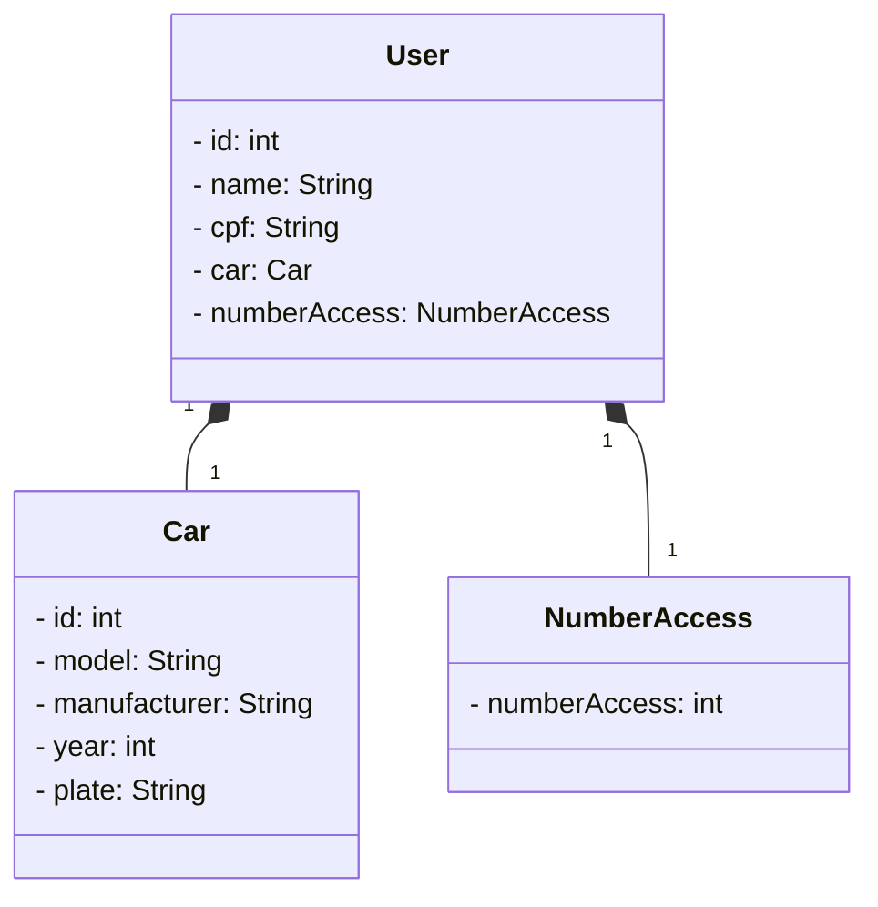

# Estacionamento-Santander-Java
RESTful API da Santander Dev Week 2023 construída em Java 17 com Spring Boot 3.

##Desenvolvi está API com base no Bootcamp da DIO.

O projeto consiste em um sistema de cadastro de usuários em um estacionamento. 

Cada usuário recebe um ID exclusivo para fins de identificação. 

O cadastro inclui informações pessoais do usuário e detalhes do seu veículo. 

Além disso, o sistema gera automaticamente um código único de acesso para cada usuário.

Caso o usuário necessite realizar uma alteração no seu veículo, ele deverá fornecer o seu ID, nome e CPF para efetuar a modificação desejada.

##Principais Tecnologias:

-**Java 17**

-**Spring Boot 3**

-**Spring Data JPA**

-**OpenAPI (Swagger)**

-**Railway**

## Diagrama de Classes

--Usuário representa um usuário com atributos id, nome, cpf, carro e númeroAccess.

--Carro representa o carro do usuário com atributos id, modelo, fabricante, ano e placa.

--NumberAccess representa um acesso numérico simples com o atributo numberAccess.

--As setas entre as classes indicam associações ou relacionamentos.
